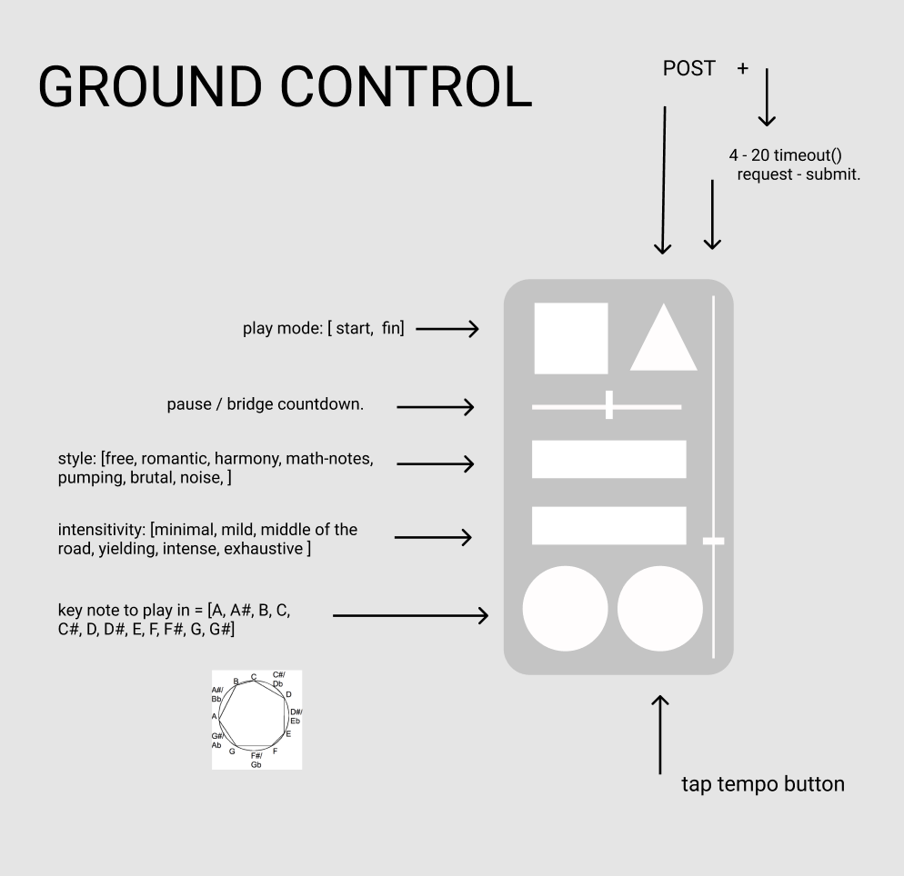
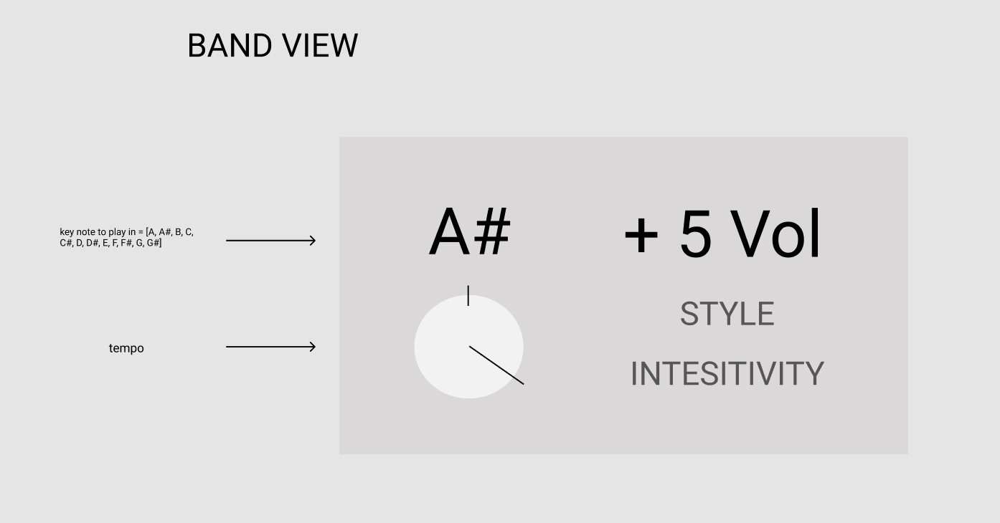

# Gunky Funky APP

### mission statment - Make an app that has the audience conducting the band.

My brother is currently in a great little psychedelic funk band, a noisy group, lots of rowdy moments. 

He made the suggestion of an orchestrator app placing some control in the hands of a person in the audience... allowing them to set a tempo, the key the group is to play in, style or changes, and stop, start or pause.

I  am researching socket.io and WebSockets to make two clients talk to each other for this, and I am hoping to get some collaboration from Andy Simms, a classmate of mine.  

