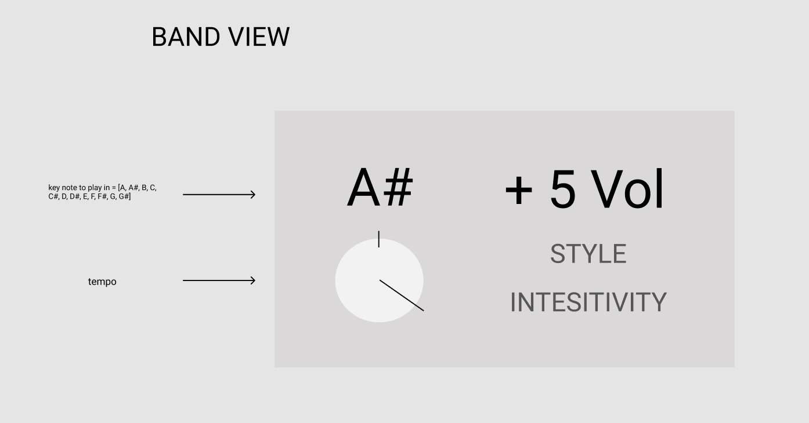
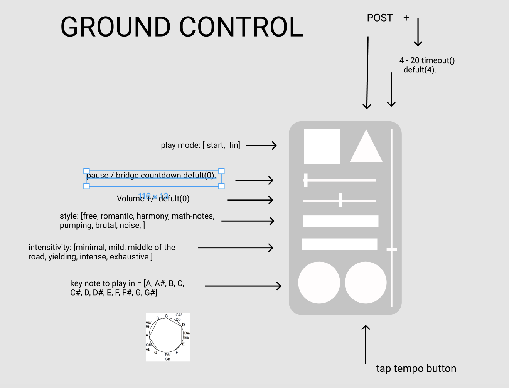

# Gunky Funky App

### Setup

after downloading the code, just open index.html on a liver server, though VSC.

# Mission Statment

This idea sprung from wanting to make a music app, with Andrew (collaborator), myself and my brother all interested in improvised bands, My brother Ben suggested I make an app that will help his band have a little structure, something that gives some control to the audience. 

I've designed a controller can let them select a tempo, the key the group is to play in, style of changes, stop, start or pause. 

At the moment this is just a testing page with a remote button opening to a client control browers and a clock to help with a tempo button. 

## NEXT STEPS

* build a server and perhaps API to send the queue cards from client to client

* Andy Simms is to help with debugging and building the server

* Test drive the app with a band. Get some feedback and make changes.

When ready to deploy, I hope to try: https://surge.sh/

## View for Band Members

## Controller View

